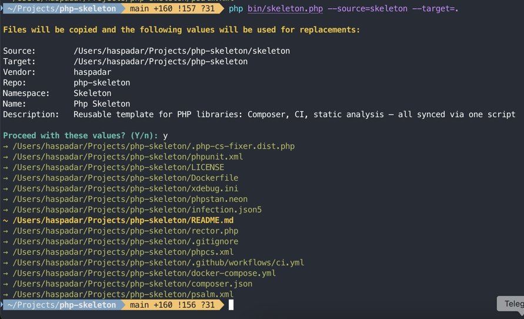

# 🧊 Skeleton


[](https://www.php.net/releases/8.4/)
[](https://github.com/FriendsOfPHP/PHP-CS-Fixer)
[](https://psalm.dev)


---

## ℹ️ About

Skeleton is a **template for EO-style PHP libraries**.  
It provides a ready-to-use boilerplate with the same checks and structure  
that will be reused across many future EO projects.

It comes with:
- consistent README header and footer sections;
- predefined CI pipeline (phpstan, psalm, rector, php-cs-fixer, infection, phpunit);
- examples of decomposition into small, final, immutable classes;
- sample I/O wrappers, tasks, and fakes for tests.


### Usage

The entrypoint is `bin/skeleton.php`.

It works in two modes:
1. **Copy-as-is** – copies template files into your target directory.
2. **Section replacement** – replaces README sections with your project-specific values.

Arguments:
- `--vendor=VendorName`
- `--repo=repo-name`
- `--namespace=MyNamespace`

Defaults are guessed from your current Git repo.

```bash
php bin/skeleton.php --vendor=haspadar --repo=php-skeleton --namespace=PhpSkeleton
```



This will generate a README and boilerplate code with the provided values.


---

## 🧠 Philosophy
- ❌ No `null`, `static`, or shared state in the public API
- ✅ One object = one responsibility
- ✅ Final classes, immutability by default
- ✅ Composition over inheritance
- ✅ Behavior and data live together

Inspired by [Elegant Objects](https://www.yegor256.com/elegant-objects.html) and [cactoos](https://github.com/yegor256/cactoos).
---

## 🧪 Quality & CI
Every push and pull request is checked via GitHub Actions:

- ✅ Static analysis with [PHPStan](https://phpstan.org/) (level 9) and [Psalm](https://psalm.dev/) (level 8)
- ✅ Type coverage report via [Shepherd](https://shepherd.dev/)
- ✅ Code style check with [PHP-CS-Fixer](https://github.com/FriendsOfPHP/PHP-CS-Fixer) (only changed files)
- ✅ Unit tests with [PHPUnit](https://phpunit.de)
- ✅ Code coverage via [Codecov](https://codecov.io/)
- ✅ Mutation testing with [Infection](https://infection.github.io)
- ✅ Composer validation, platform checks, security audit
- ✅ Automatic refactoring via [Rector](https://github.com/rectorphp/rector)
---

## 📥 Installation
```bash
composer require haspadar/php-skeleton
```

Requires PHP 8.4
---

## 📄 License

[MIT](LICENSE)